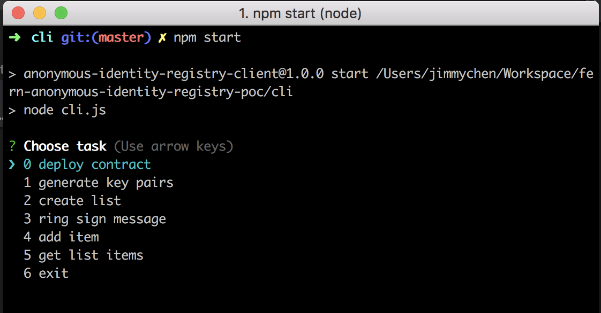

# Fern Anonymous Identity Registry PoC
Anonymous identity registry PoC using [linkable ring signatures](https://eprint.iacr.org/2004/027.pdf).

## Overview
The Anonymous Identity Registry stores a list of anonymous accounts owned by an authorised group of users, without revealing who each account belongs to. The original purpose of this work was to ensure anonymity of blockchain service providers, in order to create a more secure, and collusion-free network. See [Fern Network](https://www.fern.network/) for more details about the protocol and how this will be used in practice. However, this solution is quite generic and could be used to maintain lists of anonymous entries for other purposes.

This repository contains:
- an `AnonymousIdentityRegistry` smart contract for storing a list of anonymous accounts, owned by a set of users authorised by the contract owner. See [test cases](truffle/test/AnonymousIdentityRegistry.js) of the contract for more details.
- a CLI for generating key pairs, creating ring signatures and interacting with the `AnonymousIdentityRegistry` smart contract.

## Features
- Generate keypairs using the [SolCrypto](https://github.com/HarryR/solcrypto) library and output to a JSON file
- Generate linkable ring signatures using the [SolCrypto](https://github.com/HarryR/solcrypto) and output to a JSON file
- Registry contract owner can create a list and provide a list of authorised public keys
- Authorised public key owners can add entry to a list, by providing a valid and unique linkable ring signature
- Ability to retrieve all entries from the list

## Example Use Case
A blockchain network owner(s) wants a group of service providers to run a blockchain network using the [Validator Set](https://wiki.parity.io/Validator-Set) contract. The owner wants to ensure the validators comes from a list of verified entities, however the owner wants the provider identity on the network to be anonymous as a way to prevent collusion and increase data integrity.

Roles in this example:
- 1 network owner
- 10 authorised service providers

To create the validator set, the owner deploys the `AnonymousIdentityRegistry` smart contract, and submits a list of public keys owned by the authorised service providers to the contract.

Each authorised service providers can then to submit their anonymous account to the `AnonymousIdentityRegistry` contract, using a `linkable ring signature` to prove that they are a member in the group of authorised service providers without revealing their identity. The `AnonymousIdentityRegistry` also verify the linkable ring signature to ensure that each provider can only add ONE entry to the list.

## Example Using the CLI Tool
### Prerequisites
- Docker
- Node.js >= 8.11.3
- A running Parity instance

### Running the CLI
```
cd cli
npm i
npm start
```



### Steps
1. Service Provider executes the `generate key pairs` task to create their "public" account. This step creates a pair of public and private keys.
2. Network owner executes the `deploy contract` task to deploy the `AnonymousIdentityRegistry` smart contract to their network.
3. Network owner executes the `create list` task to create a new list and submit the list of authorised public keys to the `AnonymousIdentityRegistry`. This step creates a `listId` for the new list.
4. Service Provider executes the `ring sign message` task to sign the `listId`, using their key pair and all authroised public keys. This creates a `signature.json` signature file.
5. Service Provider executes the `add item` task and provides their signature to add their anonymous account to the list. This task creates two transactions:
  * one that commits a hash of the linkable ring signature tag and entry, to authenticate the entry and prevent others from using the same linkable ring signature. ([Commit-Reveal pattern](https://karl.tech/learning-solidity-part-2-voting/))
  * a second transaction that submits the raw entry and signature to the contract
6. Network owner can then query the list using the `get list items` task.

## Next steps
- Ring sig algorithm validation / audit
- Efficiency & gas usage optimization
